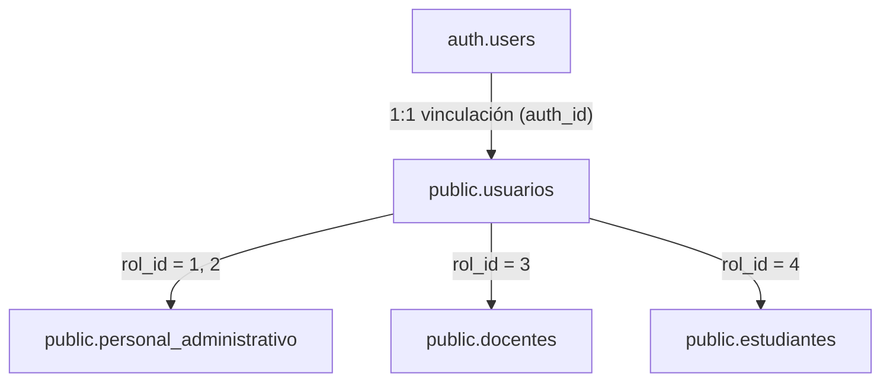

# Contexto y Esquema de Base de Datos - CBUH

Este documento proporciona una descripción detallada del esquema de base de datos, relaciones, flujo de autenticación y funcionamiento operativo del sistema de gestión académica de **CBUH (Centro Biotecnológico y Universidad Humana)** para que sirva de contexto a cualquier modelo de Inteligencia Artificial que trabaje sobre este proyecto.

---

## 🏢 Arquitectura y Tecnologías
* **Motor de Base de Datos:** PostgreSQL (alojado en **Supabase**).
* **Gestión de Sesiones/Auth:** Supabase Auth (`auth` schema) para el flujo de autenticación JWT.
* **Base Operativa:** Esquema público (`public` schema) que contiene todas las entidades académicas y de negocio.

---

## 🔐 Autenticación y Flujo de Usuarios
El sistema implementa una separación clara entre la cuenta de autenticación en Supabase y el perfil de usuario en el esquema de la base de datos de la aplicación.

1. **`auth.users` (Supabase Internal):** Almacena las credenciales principales (email, hash de contraseña en bcrypt, tokens, fecha de verificación).
2. **`public.usuarios` (App Profile Core):** Vincula el `id` de `auth.users` a través de la columna `auth_id` (UUID). Contiene la información de rol, sede física asociada, estado y el nombre de usuario de inicio de sesión.
3. **Perfiles Específicos:** Según el rol del usuario (`rol_id`), existen perfiles asociados mediante la columna `usuario_id` (Integer):
   * **Admin / Control de Estudio (Roles 1 y 2):** Relacionados en `public.personal_administrativo`.
   * **Docente (Rol 3):** Relacionados en `public.docentes`.
   * **Estudiante (Rol 4):** Relacionados en `public.estudiantes`.

---

## 👥 Roles del Sistema (`public.roles`)
El sistema define los siguientes niveles de acceso y responsabilidades:
* **`id: 1` | Administrador:** Acceso completo al sistema, configuración de sedes, creación de personal, asignación de materias y visualización de reportes.
* **`id: 2` | Control de Estudio:** Personal administrativo con capacidades de gestión escolar, carga académica, inscripciones y control documental.
* **`id: 3` | Docente:** Profesores responsables de impartir materias, administrar sus horarios y registrar calificaciones (nota de corte, nota final, reparaciones, asistencia).
* **`id: 4` | Estudiante:** Alumnos del centro que pueden preinscribirse, subir documentos probatorios y visualizar sus materias, horarios y calificaciones vigentes.

---

## 📋 Diccionario de Tablas (`public` schema)

### 1. `public.usuarios`
Gestiona el acceso de usuarios al sistema y su relación con sedes y roles.
* `id` (`integer`, PK): Identificador único secuencial de la aplicación.
* `usuario` (`varchar`, NOT NULL, UNIQUE): Nombre de usuario utilizado para login (suele ser la cédula para alumnos/docentes o el prefijo del email para administradores).
* `clave_hash` (`varchar`, NOT NULL): Contraseña en texto plano para respaldo histórico/legacy.
* `correo` (`varchar`, UNIQUE): Dirección de correo electrónico.
* `rol_id` (`integer`, FK): Referencia a `public.roles(id)`.
* `estado_id` (`integer`, FK): Referencia a `public.estados_registro(id)`.
* `sede_id` (`integer`, FK): Referencia a `public.sedes(id)` (Asegura la segregación de datos por sede).
* `auth_id` (`uuid`, UNIQUE): Vinculación al identificador único generado por `auth.users` de Supabase.

### 2. `public.sedes`
Entidad para manejar las diferentes sedes físicas de la universidad.
* `id` (`integer`, PK)
* `nombre` (`varchar`): Nombre de la sede (Ej. "Sede Principal").
* `codigo` (`varchar`, UNIQUE): Prefijo identificador corto (Ej. "MAIN", "GUAYANA").
* `nota_minima` (`numeric`, default `10.00`): Nota mínima aprobatoria (para cálculos de calificaciones).
* `escala_maxima` (`numeric`, default `20.00`): Escala de nota máxima (Ej. base 20 o base 100).
* `estado_id` (`integer`, FK): Referencia a `public.estados_registro(id)`.

### 3. `public.personal_administrativo`
Perfiles para administradores y coordinadores de control de estudio.
* `id` (`integer`, PK)
* `usuario_id` (`integer`, FK): Enlace a `public.usuarios(id)`.
* `cedula` (`varchar`, nullable): Documento nacional de identidad.
* `nombres` (`varchar`), `apellidos` (`varchar`): Datos personales.
* `cargo` (`varchar`): Cargo ocupado (Ej. "Director de Control de Estudio").
* `sede_id` (`integer`, FK): Enlace a `public.sedes(id)`.

### 4. `public.estudiantes`
Perfiles de los alumnos inscritos en la institución.
* `id` (`integer`, PK)
* `usuario_id` (`integer`, FK): Enlace a `public.usuarios(id)`.
* `cedula` (`varchar`, UNIQUE): Cédula de identidad.
* `nombres` (`varchar`), `apellidos` (`varchar`): Datos del alumno.
* `año_actual` (`integer`, default `1`): Año de carrera cursado por el estudiante.
* `numero_matricula` (`varchar`, UNIQUE): Matrícula estudiantil asignada.
* `sede_id` (`integer`, FK): Sede donde cursa estudios.
* `estado_id` (`integer`, FK): Estado del alumno en el registro.

### 5. `public.documentos_estudiantes`
Control de archivos probatorios cargados por estudiantes para su registro.
* `id` (`integer`, PK)
* `estudiante_id` (`integer`, FK): Estudiante dueño de los documentos.
* `tipo_documento` (`varchar`): Tipo de archivo cargado (`foto_perfil`, `cedula`, `titulo_bachiller`, `notas_certificadas`, `partida_nacimiento`).
* `url_archivo` (`varchar`): URL pública del archivo en Supabase Storage (Buckets: `avatars` o `documentos`).
* `verificado` (`boolean`, default `false`): Bandera para indicar si Control de Estudio validó el documento.
* `verificado_por` (`integer`, FK): Usuario administrativo (`public.usuarios(id)`) que verificó el archivo.

### 6. `public.docentes`
Perfiles para los profesores de las materias.
* `id` (`integer`, PK)
* `usuario_id` (`integer`, FK): Enlace a `public.usuarios(id)`.
* `cedula` (`varchar`, UNIQUE): Cédula de identidad.
* `nombres` (`varchar`), `apellidos` (`varchar`): Datos personales del docente.
* `especialidad` (`varchar`): Área de conocimiento.

### 7. `public.periodos_academicos`
Ciclos escolares o lapsos académicos vigentes.
* `id` (`integer`, PK)
* `codigo` (`varchar`, UNIQUE): Código del periodo (Ej. "2026-I").
* `nombre` (`varchar`): Nombre legible (Ej. "Primer Semestre 2026").
* `fecha_inicio` / `fecha_fin` (`date`): Límites temporales del periodo académico.
* `fecha_inicio_inscripcion` / `fecha_fin_inscripcion` (`date`): Lapso en el que la preinscripción estudiantil está activa.

### 8. `public.materias`
Unidades curriculares que conforman el pensum.
* `id` (`integer`, PK)
* `codigo` (`varchar`, UNIQUE): Código identificador de la materia.
* `nombre_materia` (`varchar`): Nombre de la materia.
* `año_materia` (`integer`): Año de la carrera al que pertenece.
* `orden_secuencia` (`integer`): Posición cronológica de la materia en el año (Ej. Mes 1, Mes 2, etc.).
* `sede_id` (`integer`, FK): Sede en la cual está configurada.

### 9. `public.secciones`
Aulas físicas o grupos asignados a una materia.
* `id` (`integer`, PK)
* `nombre` (`varchar`, UNIQUE): Nombre identificador (Ej. "A", "B").
* `capacidad` (`integer`, default `40`): Límite máximo de alumnos admitidos.
* `materia_id` (`bigint`, FK): Enlace a `public.materias(id)`.

### 10. `public.cargas_academicas`
Tabla pivote fundamental que une un docente, una materia, una sección y un periodo. Representa una clase dictada formalmente.
* `id` (`integer`, PK)
* `periodo_id` (`integer`, FK): Enlace a `public.periodos_academicos(id)`.
* `materia_id` (`integer`, FK): Enlace a `public.materias(id)`.
* `docente_id` (`integer`, FK): Enlace a `public.docentes(id)`.
* `seccion_id` (`integer`, FK): Enlace a `public.secciones(id)`.
* `es_confirmada` (`boolean`, default `false`): Si fue validada por administración.

### 11. `public.horarios`
Horas y días específicos en los que se imparte una carga académica.
* `id` (`integer`, PK)
* `carga_academica_id` (`integer`, FK): Enlace a `public.cargas_academicas(id)`.
* `dia_semana` (`integer`): Día en formato numérico (1: Lunes, 2: Martes... 7: Domingo).
* `hora_inicio` / `hora_fin` (`time`): Rango horario.
* `mes` (`integer`, default `1`): Mes lectivo específico para la clase.

### 12. `public.inscripciones`
Mapeo de la inscripción formal de un estudiante en una carga académica específica.
* `id` (`integer`, PK)
* `carga_academica_id` (`integer`, FK): Enlace a `public.cargas_academicas(id)`.
* `estudiante_id` (`integer`, FK): Enlace a `public.estudiantes(id)`.

### 13. `public.calificaciones`
Almacenamiento centralizado de notas y asistencias del alumno por materia.
* `id` (`integer`, PK)
* `inscripcion_id` (`integer`, UNIQUE, FK): Enlace a `public.inscripciones(id)`.
* `nota_corte` (`numeric`): Nota parcial acumulada (Midterm).
* `nota_final` (`numeric`): Nota definitiva regular.
* `nota_reparacion` (`numeric`): Calificación de recuperación (en caso de reprobar la definitiva regular).
* `estado_materia` (`varchar`, default `'CURSANDO'`): Estatus del alumno en el curso (`CURSANDO`, `APROBADO`, `REPROBADO`, `REPARACION`).
* `asistencia` (`numeric`): Porcentaje de asistencias acumuladas.

### 14. `public.materias_prelaciones`
Define qué materias se requieren aprobar antes de poder cursar otras.
* `id` (`integer`, PK)
* `materia_id` (`integer`, FK): La materia que tiene prelación.
* `prelacion_id` (`integer`, FK): La materia que debe haberse aprobado previamente.

### 15. `public.configuraciones`
Configuraciones globales por sede (Ej. si la inscripción está abierta, carga de notas activa, etc.).
* `id` (`bigint`, PK)
* `clave` (`text`): Nombre de la propiedad (`inscripciones_abiertas`, `carga_notas_abierta`, `edicion_horarios_abierta`, `logo_url_sede`, `nombre_sede`, etc.).
* `valor` (`text`): Valor de la propiedad.
* `sede_id` (`bigint`): Sede de la configuración.

---

## ⚙️ Reglas de Operación y Funcionamiento para IAs

### 1. Segregación por Sede (`sede_id`)
* **IMPORTANTE:** Toda consulta y acción en el dashboard administrativo y módulos académicos debe realizarse filtrando por la sede del administrador activo (`sede_id` que se encuentra en `public.usuarios` del usuario autenticado). La mezcla de registros entre sedes diferentes está estrictamente restringida por lógica de negocio.

### 2. Flujo del Ciclo de Vida de Notas (`public.calificaciones`)
* Una calificación se genera inmediatamente al insertar una inscripción (`public.inscripciones`).
* Las notas pueden ser cargadas por el profesor en la fase "Corte" (`nota_corte`) o en la fase "Final" (`nota_final`).
* Si la `nota_final` es menor que la `nota_minima` de la sede (por ejemplo, `< 10` en escala de 20), el estado pasa a `REPARACION` o `REPROBADO` según las reglas del reglamento de la sede.
* Si el alumno rinde el examen remedial, se carga su nota en `nota_reparacion`, la cual determina su estado de aprobación definitivo.

### 3. Registro Documental de Alumnos
* Un estudiante no puede tener un estado de inscripción completamente verificado si no ha subido los 4 archivos obligatorios:
  1. Cédula de Identidad (`cedula`)
  2. Título de Bachiller (`titulo_bachiller`)
  3. Notas Certificadas (`notas_certificadas`)
  4. Partida de Nacimiento (`partida_nacimiento`)
* El sistema evalúa y muestra notificaciones críticas de documentos faltantes en el panel administrativo basándose en la presencia o ausencia de estos registros en `public.documentos_estudiantes`.

---

## 🔒 Estado de Seguridad (Aviso de RLS)
* Las siguientes tablas tienen **Row Level Security (RLS) desactivado** para permitir accesos y pruebas ágiles: `public.estados_registro`, `public.roles`, `public.usuarios`, `public.materias_prelaciones`.
* En un entorno productivo público, se debe activar RLS con comandos como `ALTER TABLE public.usuarios ENABLE ROW LEVEL SECURITY;` y configurar las políticas de acceso según corresponda para evitar la fuga de información confidencial.
